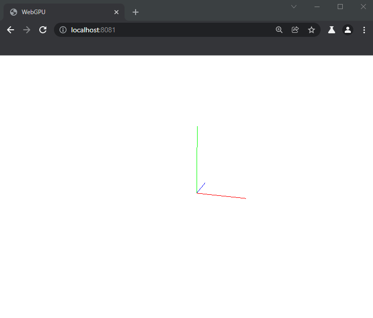
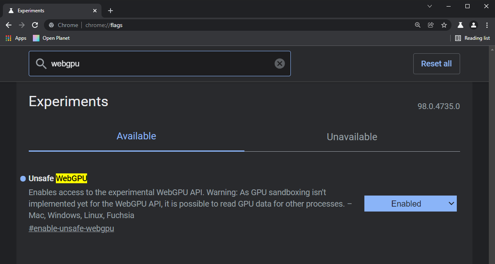

# guppy-gpu example

## Setup

Clone this repository
```
$ git clone https://github.com/oppenheimj/guppy-gpu-example
```

Install dependencies
```
$ npm install
```

Run the app
```
$ npm run serve
```

Browse to http://localhost:8081/ in a WebGPU-compatible browser, such as Chrome Canary. See instructions at the end if you don't have Chrome Canary.

You should be able to move and look around with keys W, A, S, D, Q, and E, and your mouse. You'll see an Entity moving around.



Chrome Canary setup instructions:
1. Download Chrome Canary from [here](https://www.google.com/chrome/canary/).
2. Browse to **chrome://flags**, search for **webgpu**, and enable **Unsafe WebGPU** (see screenshot below).
